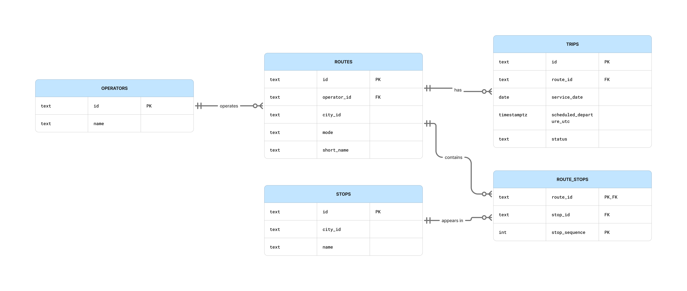

# Lecture 1 implementation lab

## Purpose

Build the smallest relational model that supports route maintenance and upcoming-trip queries. The implementation is not expected to represent the complete MobilityTicketing platform. It should make your modelling assumptions executable.

## Timebox

Approximately 90 minutes.

## Work in this lecture

1. Create tables for operators, routes, stops, route stops, and trips.
2. Decide the primary key of the route-stop relation and explain the decision.
3. Add primary-key and foreign-key relationships.
4. Insert the supplied seed data.
5. Write the three workload queries in `database/postgres/003_queries.sql.example`.
6. Compare the implemented schema with your ER diagram and record any difference.

## Workload queries

1. Show the next 20 scheduled trips for a route after a supplied timestamp.
2. Show the ordered stops belonging to a route.
3. Show all routes and the number of scheduled trips on a supplied service date, including routes with no trips.

## Do not implement yet

Do not add MongoDB, Redis, caching, event queues, payment logic, validation logic, reporting tables, or performance indexes. Those decisions are introduced later.

## Required evidence

- A schema that can be recreated from an empty database.
- Seed data that can be loaded more than once without manual editing.
- The three queries and representative results.
- A short note identifying one modelling assumption that may change later.
- A system context, access-pattern map, ER diagram, and one functional dependency note.

## Submission checklist

- [ ] Describe the customers, operators, and city transport context without naming a database product.
- [ ] Cover route search, ticket purchase, ticket validation, timetable updates, real-time availability, and reporting in the access-pattern map.
- [ ] Include identifiers, relationships, and cardinalities in the ER diagram.
- [ ] Explain one functional dependency and what normalization prevents.
- [ ] State what the implementation proves and what remains unknown.
- [ ] Commit the implementation under `database/postgres/`.

## ER Diagram

## Modelling assumption

A stop may occur more than once on the same route, for example on a circular route.

Therefore, the primary key of `route_stops` is `(route_id, stop_sequence)`.

## Functional dependency

For the `routes` table:

`id -> operator_id, city_id, mode, short_name`

This means that each route ID uniquely determines the operator, city, transport mode, and short name of that route.

## Query explanation

The ordered-stop query uses `route_stops` to determine which stops belong to a route and in which sequence they appear.

It joins the `stops` table to retrieve the stop name and orders the result by `stop_sequence`.

This avoids duplicating stop information inside `route_stops`.

## What the implementation proves

The implementation shows that the relational model can support:

- route maintenance
- ordered route stops
- upcoming scheduled trips
- counting scheduled trips per route

The schema also demonstrates the primary-key and foreign-key relationships between operators, routes, stops, route stops, and trips.

## What remains unknown

This implementation does not yet cover:

- ticket purchase
- ticket validation
- real-time availability
- payment handling
- caching
- reporting performance

These areas are intentionally left for later lectures.